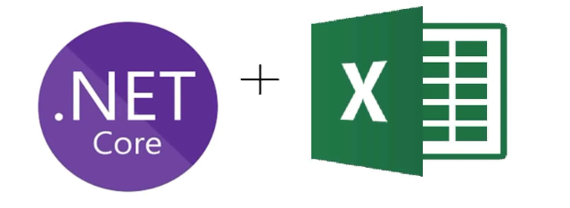
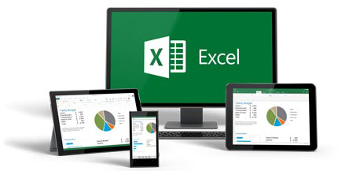

# Learn how to work with basic Excel operations in C#



For the majority of code samples they can be used cross-platform.



# Stuck on automation

For ages coders and developers alike believe that when working with Excel that Excel automation is the best way but there are many issues while when working with .xlsx libraries like GemBox, Aspose cells and others solve these problems. 

Problem for those on a shoe-string budget is these libraries are out of reach cost-wise. So this repository I picked one of many free libraries, [SpreadSheetLight](https://spreadsheetlight.com/) and [EEPlus](https://www.epplussoftware.com/en) ([license](https://www.epplussoftware.com/en/Home/LgplToPolyform)) to show how to perform common operations for Excel.

Using Excel automation to create and Excel file (not my code)

```csharp
using Microsoft.Office.Interop.Excel;
using System.Reflection;

namespace ConsoleApplication1
{
    class Program
    {
        static void Main(string[] args)
        {
            Application xl = null;
            _Workbook wb = null;

            // Option 1
            xl = new Application();
            xl.Visible = true;
            wb = (_Workbook)(xl.Workbooks.Add(XlWBATemplate.xlWBATWorksheet));

            // Option 2
            xl = new Application();
            xl.SheetsInNewWorkbook = 1;
            xl.Visible = true;
            wb = (_Workbook)(xl.Workbooks.Add(Missing.Value));

        }
    }
}
```

# Moving to Open XML

**With SpreadSheetLight**

```csharp
public bool CreateNewFile(string pFileName)
{
    using SLDocument document = new();
    document.SaveAs(pFileName);
    return true;
}
```

One extra line to rename the default worksheet

```csharp
public bool CreateNewFile(string pFileName, string pSheetName)
{
    using SLDocument document = new();
    document.RenameWorksheet("Sheet1", pSheetName);
    document.SaveAs(pFileName);
    return true;
}
```

# EPPlus

Create a new file

```csharp
public static void CreateNewFile()
{
    var filePath = Path.Combine(AppDomain.CurrentDomain.BaseDirectory, _excelBaseFolder, "NewFile.xlsx");
    using var package = new ExcelPackage();
    var worksheet = package.Workbook.Worksheets.Add("FirstSheet");
    package.SaveAs(filePath);
}
```


# Notes

Personally my choice is `GemBox.SpreadSheet` and `Asose.Cells` which are not cheap but well worth the cost if a developer is doing a lot of Excel work. `EPPlus` is one to select if on a shoe-string budget and SpreadSheetLight for no budget.

- Some examples use `Entity Framework Core`
- One example uses `OleDb`.
  - [OleDb](https://docs.microsoft.com/en-us/office/vba/api/excel.oledbconnection) is limiting in many ways e.g. no formatting and prone to issues with data types.
- Most examples use SpreadSheetLight and EEPlus, free Excel library
  - EPPlus is thread safe
  - SpreadSheetLight is not thread safe
- There is one Excel automation code sample, best to avoid automation as it can have issues with versioning, server side use and is not cross-platform.
- When a database is used the project incudes a script to create the database.
- Code written in Microsoft Visual Studio 2019, .NET Core 5, C#9 and will work in Microsoft Visual Studio 2022, .NET Core 6.